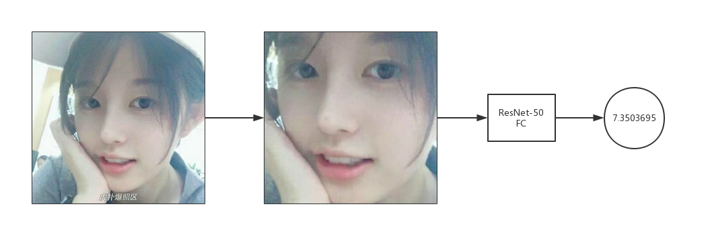

# hupu-score

> 虎扑爆照区自动评分

## Dataset

Hupu: [盒宫大会api](https://api-staging.jfbapp.cn/quiz/5)

```bash
python crawl.py
```

SCUT: [SCUT-FBP5500-Database](https://github.com/HCIILAB/SCUT-FBP5500-Database-Release)

## Model

Network: ResNet50 + FC

Loss: MAE (MAE >> MSE)

## Env

```bash
pip install requests
pip install tensorflow-gpu==1.11
pip install face_recognition
```

## Train

Fine-Tune: Fix ResNet & Train FC

```bash
python keras.py --mode fine_tune
```

Full-Train: Train ResNet & FC

```bash
python keras.py --mode train
```

## Predict

```bash
python keras.py --mode predict --image test.jpg
```

## Examples

 
